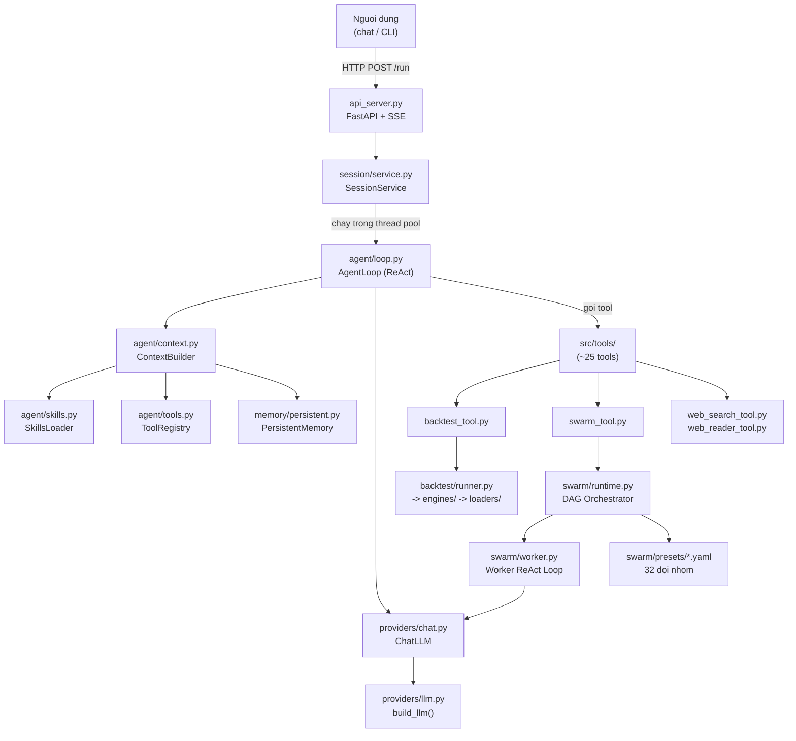
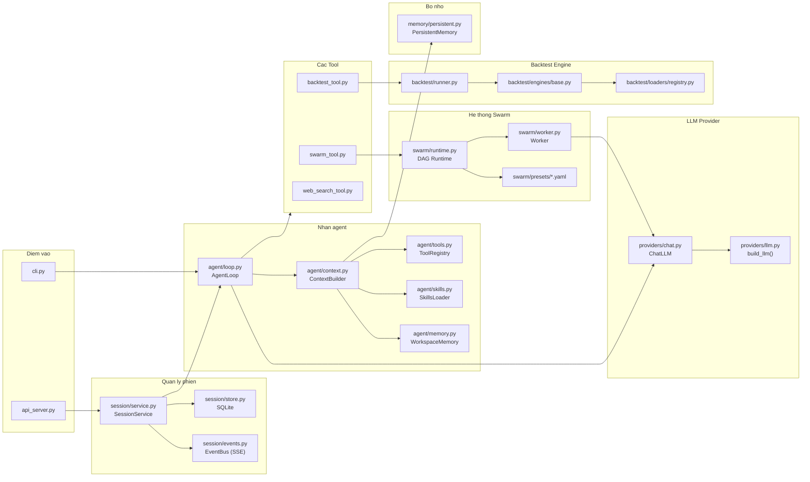

# Kiến Trúc Project Vibe-Trading — Hướng Dẫn Đọc Code

> Tài liệu này dành cho người đã biết đọc Python nhưng chưa quen codebase này.
> Tập trung vào `agent/src/` và `agent/backtest/` — đây là trái tim của hệ thống.

---

## 1. Sơ đồ tổng quan

---

## 2. Luồng xử lý khi người dùng hỏi

Khi người dùng gửi một câu hỏi qua giao diện (web / CLI), hệ thống xử lý theo thứ tự sau:

**Bước 1 — Nhận request**
`api_server.py` nhận HTTP POST `/run`. FastAPI trả về stream SSE (Server-Sent Events) để frontend hiển thị real-time.

**Bước 2 — Tạo Session & Attempt**
`session/service.py` (class `SessionService`) tạo một `Session` và một `Attempt` trong SQLite (`session/store.py`). Session lưu toàn bộ lịch sử hỏi đáp.

**Bước 3 — Chạy AgentLoop trong thread**
`SessionService` đẩy task vào `ThreadPoolExecutor` (tối đa 4 luồng đồng thời). Luồng đó chạy `agent/loop.py` — đây là vòng lặp ReAct chính.

**Bước 4 — Xây dựng System Prompt**
`AgentLoop` gọi `ContextBuilder.build_system_prompt()`. `ContextBuilder` tập hợp:
- Danh sách mô tả ngắn gọn của tất cả tools (từ `ToolRegistry`)
- Danh sách một dòng của từng skill (từ `SkillsLoader`)
- Bộ nhớ liên phiên (từ `PersistentMemory`)
- Ngày giờ hiện tại, ngôn ngữ

**Bước 5 — Gọi LLM**
`ChatLLM` (trong `providers/chat.py`) gửi messages tới LLM qua `build_llm()` (trong `providers/llm.py`). LLM tương thích với OpenAI-format (ChatOpenAI, DeepSeek, Moonshot, OpenRouter...).

**Bước 6 — Thực hiện Tool**
Nếu LLM trả về `tool_calls`, `AgentLoop` tra cứu tên tool trong `ToolRegistry` và gọi `.run()`. Kết quả được thêm vào lịch sử tin nhắn rồi lặp lại Bước 5.

**Bước 7 — Trả kết quả**
Khi LLM không còn gọi tool nữa, `AgentLoop` trả về văn bản cuối cùng. `SessionService` lưu vào store, `api_server.py` kết thúc SSE stream.

---

## 3. Cấu trúc thư mục giải thích

### `agent/api_server.py`
**Là gì:** Cổng vào duy nhất của hệ thống. FastAPI app phục vụ cả REST API lẫn SSE stream.
**File quan trọng:** Chính là file này — không có thư mục riêng.
**Kết nối với:** `session/service.py` (chuyển request), `src/ui_services.py` (phân tích run history).

---

### `agent/src/agent/`
**Là gì:** Trái tim của AI agent — quản lý vòng lặp suy luận và trạng thái.

| File | Vai trò |
|------|---------|
| `loop.py` | `AgentLoop` — vòng lặp ReAct chính. Quản lý 5 lớp nén context, điều phối tool, heartbeat |
| `context.py` | `ContextBuilder` — xây dựng system prompt từ tools + skills + memory |
| `skills.py` | `SkillsLoader` — đọc các thư mục `skills/*/SKILL.md`, tổ chức theo danh mục |
| `tools.py` | `BaseTool` + `ToolRegistry` — abstract class cho mỗi tool, tập hợp các tool được đăng ký |
| `memory.py` | `WorkspaceMemory` — bộ nhớ trong phiên (trong RAM, mất khi phiên kết thúc) |
| `progress.py` | `ProgressEvent` + `HeartbeatTimer` — phát SSE event "đang làm..." đến frontend |
| `trace.py` | `TraceWriter` — ghi log chi tiết mỗi tool call vào file trace.jsonl |
| `frontmatter.py` | Phân tích YAML frontmatter của file `.md` (dùng cho skills và memory) |

---

### `agent/src/tools/`
**Là gì:** Các khả năng cụ thể mà agent có thể sử dụng. Mỗi file là một tool.

| File | Chức năng |
|------|-----------|
| `backtest_tool.py` | Chạy backtest — validate `config.json` + `signal_engine.py`, gọi `core/runner.py` |
| `swarm_tool.py` | Kích hoạt đội nhóm đa agent — tự động chọn preset phù hợp |
| `web_search_tool.py` | Tìm kiếm web (Tavily / SerpAPI) |
| `web_reader_tool.py` | Đọc nội dung URL / PDF từ xa |
| `doc_reader_tool.py` | Đọc file PDF nội bộ đã upload |
| `factor_analysis_tool.py` | Chạy phân tích nhân tố (factor research) |
| `alpha_zoo_tool.py` | Tính toán alpha từ thư viện alpha (Alpha101, GTJA191...) |
| `alpha_bench_tool.py` | Benchmark hiệu suất các alpha |
| `options_pricing_tool.py` | Định giá quyền chọn (Black-Scholes, Greeks) |
| `shadow_account_tool.py` | Phân tích nhật ký giao dịch, xây dựng "shadow account" |
| `trade_journal_tool.py` | Đọc và phân tích file CSV/Excel giao dịch của người dùng |
| `load_skill_tool.py` | Tải nội dung đầy đủ của một skill theo yêu cầu |
| `remember_tool.py` | Lưu thông tin vào `PersistentMemory` để dùng ở phiên sau |
| `session_search_tool.py` | Tìm kiếm trong lịch sử phiên cũ |
| `bash_tool.py` | Chạy lệnh shell (dùng cho script tùy chỉnh) |
| `read_file_tool.py` / `write_file_tool.py` / `edit_file_tool.py` | Thao tác file trong `run_dir` |
| `compact_tool.py` | Yêu cầu nén context (kích hoạt Layer 3 của `AgentLoop`) |
| `hypothesis_tool.py` | Quản lý giả thuyết nghiên cứu |
| `skill_writer_tool.py` | Tạo hoặc chỉnh sửa skill mới |
| `pattern_tool.py` | Nhận dạng mẫu hình kỹ thuật trên giá |
| `mcp.py` | Kết nối Model Context Protocol (MCP) với tool bên ngoài |

---

### `agent/src/skills/`
**Là gì:** Thư viện chuyên môn — mỗi thư mục con là một "skill" với file `SKILL.md` mô tả cách dùng API và ví dụ. Skills không chạy trực tiếp; agent đọc chúng qua `load_skill_tool.py` khi cần.

**Một số skill nổi bật:**

| Thư mục | Lĩnh vực |
|---------|----------|
| `vn-equity-market/` | Thị trường cổ phiếu Việt Nam (HOSE, HNX) |
| `vn-derivatives/` | Phái sinh Việt Nam (VN30F, chứng quyền) |
| `vn-macro/`, `vn-sectors/` | Kinh tế vĩ mô và ngành Việt Nam |
| `tushare/` | Dữ liệu cổ phiếu A-share Trung Quốc (Tushare API) |
| `okx-market/` | Dữ liệu giao ngay + phái sinh OKX |
| `backtest-diagnose/` | Chẩn đoán kết quả backtest |
| `strategy-generate/` | Tạo file `signal_engine.py` đúng cấu trúc chuẩn |
| `ml-strategy/` | Chiến lược học máy (LSTM, XGBoost...) |
| `factor-research/` | Nghiên cứu nhân tố (factor investing) |
| `options-strategy/` | Chiến lược quyền chọn phức tạp |
| `shadow-account/` | Xây dựng tài khoản bóng từ nhật ký giao dịch |
| `report-generate/` | Tạo báo cáo markdown / PDF |
| `chanlun/`, `elliott-wave/`, `ichimoku/`, `smc/`, `harmonic/` | Phương pháp phân tích kỹ thuật chuyên sâu |

---

### `agent/src/swarm/`
**Là gì:** Hệ thống đa agent — phân phối công việc cho nhiều "worker" agent chạy song song.

| File | Vai trò |
|------|---------|
| `runtime.py` | DAG orchestrator: lập lịch worker theo lớp topo, song song trong mỗi lớp |
| `worker.py` | Worker: vòng lặp ReAct thu nhỏ (không dùng `AgentLoop`), tự cung cấp chat + tools |
| `presets.py` | Đọc file YAML từ `presets/`, chuyển thành `SwarmRun` data model |
| `presets/*.yaml` | 32 template đội nhóm (equity research, VN investment committee, crypto desk...) |
| `models.py` | Data model: `SwarmRun`, `SwarmTask`, `SwarmAgentSpec`, `WorkerResult` |
| `task_store.py` | Lưu trạng thái task, tính toán thứ tự topo |
| `grounding.py` | Inject context chung (ngày giờ, market data) cho cả đội |
| `store.py` | Lưu kết quả swarm ra file |

---

### `agent/src/providers/`
**Là gì:** Lớp trung gian giữa agent và LLM thực tế.

| File | Vai trò |
|------|---------|
| `llm.py` | `build_llm()` — factory tạo đối tượng LLM từ biến môi trường. Hỗ trợ ChatOpenAI, DeepSeek, Moonshot, OpenRouter |
| `chat.py` | `ChatLLM` — wrapper đơn giản: gửi messages, nhận tool calls hoặc văn bản, xử lý streaming |
| `llm_providers.json` | Cấu hình các provider (tên model, base_url, timeout) |
| `openai_codex.py` | Hỗ trợ Codex / o1 model (reasoning model đặc biệt) |

---

### `agent/src/session/`
**Là gì:** Quản lý phiên làm việc và lịch sử hỏi đáp.

| File | Vai trò |
|------|---------|
| `service.py` | `SessionService` — tạo session, attempt, điều phối chạy agent trong thread pool |
| `store.py` | SQLite persistence cho `Session` và `Message` |
| `models.py` | Data model: `Session`, `Message`, `Attempt`, `AttemptStatus` |
| `events.py` | `EventBus` — kênh SSE phát trạng thái real-time đến API server |
| `search.py` | Tìm kiếm full-text trên lịch sử phiên cũ |

---

### `agent/src/memory/`
**Là gì:** Bộ nhớ lâu dài giữa các phiên.

| File | Vai trò |
|------|---------|
| `persistent.py` | `PersistentMemory` — lưu file Markdown vào `~/.vibe-trading/memory/`. Mỗi mục là `.md` với YAML frontmatter. Index tối đa 200 dòng |

---

### `agent/src/config/`
**Là gì:** Đọc cấu hình hệ thống.

| File | Vai trò |
|------|---------|
| `loader.py` | Đọc `.env` và các biến môi trường cấu hình (API keys, model name, token threshold...) |
| `schema.py` | Pydantic schema cho cấu hình |
| `paths.py` | Các đường dẫn chuẩn (RUNS_DIR, SESSIONS_DIR...) |

---

### `agent/src/security/`
**Là gì:** Bảo mật chống prompt injection.

| File | Vai trò |
|------|---------|
| `scanner.py` | Quét nội dung từ web/PDF, gắn cảnh báo nếu phát hiện dấu hiệu prompt injection. Không chỉnh sửa nội dung — chỉ thêm metadata cảnh báo |

---

### `agent/src/core/`
**Là gì:** Lớp tiện ích chung cho cả agent và backtest.

| File | Vai trò |
|------|---------|
| `runner.py` | `Runner` — chạy `backtest.runner` dưới dạng subprocess, thu thập artifact |
| `state.py` | `RunStateStore` — tạo thư mục run mới (`runs/YYYYMMDD_HHMMSS_xxx/`), lưu trạng thái JSON |

---

### `agent/src/api/`
**Là gì:** Route bổ sung của FastAPI cho các tính năng đặc biệt.

| File | Vai trò |
|------|---------|
| `alpha_routes.py` | Endpoint riêng cho alpha zoo, alpha bench |
| `runner.py` | Wrapper FastAPI cho core runner |
| `state.py` | Endpoint trả về trạng thái run |

---

### `agent/backtest/`
**Là gì:** Engine backtest độc lập. Được gọi như một subprocess bởi `core/runner.py`.

| File/Thư mục | Vai trò |
|--------------|---------|
| `runner.py` | Điểm vào chính: đọc `config.json`, chọn loader, import `signal_engine.py`, chạy engine |
| `engines/base.py` | `BaseEngine` — vòng lặp bar-by-bar chung: load data → sinh tín hiệu → optimizer → thực hiện lệnh → tính metric |
| `engines/china_a.py` | Engine thị trường A-share (giới hạn T+1, limit up/down) |
| `engines/crypto.py` | Engine crypto (24/7, phí maker/taker) |
| `engines/global_equity.py` | Engine cổ phiếu quốc tế (US, HK, EU) |
| `engines/forex.py` | Engine ngoại hối (pip, lot size) |
| `engines/options_portfolio.py` | Engine danh mục quyền chọn |
| `engines/composite.py` | Kết hợp nhiều engine (đa thị trường) |
| `loaders/registry.py` | `LOADER_REGISTRY` + fallback chain: nếu loader chính lỗi, tự động thử loader dự phòng |
| `loaders/tushare.py` | Tải dữ liệu A-share qua Tushare API |
| `loaders/yfinance_loader.py` | Tải dữ liệu cổ phiếu quốc tế qua yfinance |
| `loaders/ccxt_loader.py` | Tải dữ liệu crypto qua CCXT |
| `loaders/akshare_loader.py` | Dữ liệu A-share dự phòng (AkShare) |
| `loaders/okx.py` | Dữ liệu OKX (spot + derivatives) |
| `metrics.py` | Tính Sharpe, Sortino, max drawdown, CAGR, trade stats |
| `models.py` | Data model cho backtest config và kết quả |
| `validation.py` | Kiểm tra `config.json` và `signal_engine.py` trước khi chạy |
| `benchmark.py` | So sánh hiệu suất vs chỉ số tham chiếu |
| `correlation.py` | Phân tích tương quan giữa các chiến lược |
| `run_card.py` | Tạo "run card" — tóm tắt kết quả dạng Markdown |

---

### `agent/src/factors/`
**Là gì:** Thư viện nhân tố định lượng.

| Thư mục | Nội dung |
|---------|----------|
| `zoo/alpha101/` | 101 alpha formula từ WorldQuant |
| `zoo/gtja191/` | 191 alpha của GTJA Securities |
| `zoo/qlib158/` | 158 nhân tố từ Microsoft Qlib |
| `zoo/academic/` | Nhân tố học thuật (Value, Momentum, Quality...) |

---

### `agent/src/shadow_account/`
**Là gì:** Phân tích hành vi giao dịch người dùng và tạo "tài khoản bóng" (shadow account) để backtest chiến lược ẩn giấu của họ.

---

### `agent/src/hypotheses/`
**Là gì:** Lưu trữ và quản lý giả thuyết nghiên cứu (dùng với `hypothesis_tool.py`).

---

## 4. Sơ đồ quan hệ giữa các file chính

---

## 5. Khi người dùng hỏi X, file nào chạy?

| Người dùng hỏi / làm gì | File bắt đầu | File xử lý chính | Dữ liệu / engine |
|-------------------------|--------------|-------------------|------------------|
| "Backtest chiến lược MA crossover cho VN30" | `backtest_tool.py` | `core/runner.py` → `backtest/runner.py` | `engines/china_a.py` hoặc `engines/global_equity.py` + loader tự động |
| "Tìm kiếm tin tức về Bitcoin" | `web_search_tool.py` | Tavily / SerpAPI API | `security/scanner.py` (quét injection) |
| "Đọc báo cáo PDF này" | `doc_reader_tool.py` | `web_reader_tool.py` | File đã upload trong `uploads/` |
| "Chạy đội phân tích VN market hôm nay" | `swarm_tool.py` | `swarm/runtime.py` → `swarm/worker.py` | `presets/vn_market_daily.yaml` |
| "Tính Alpha101 cho cổ phiếu VCB" | `alpha_zoo_tool.py` | `factors/zoo/alpha101/` | Loader (tushare / yfinance) |
| "Định giá quyền chọn VN30F" | `options_pricing_tool.py` | `skills/options-strategy/SKILL.md` | Black-Scholes (nội bộ) |
| "Phân tích nhật ký giao dịch của tôi" | `trade_journal_tool.py` | `trade_journal_parsers.py` | File CSV/Excel người dùng upload |
| "Lưu ý thích của tôi" | `remember_tool.py` | `memory/persistent.py` | `~/.vibe-trading/memory/` |
| "Hiện tại bạn đang làm gì?" | `agent/progress.py` | SSE qua `session/events.py` | EventBus push → frontend |
| "Tải skill backtest-diagnose" | `load_skill_tool.py` | `agent/skills.py` → `skills/backtest-diagnose/SKILL.md` | File Markdown nội bộ |
| "Viết factor mới cho A-share" | `bash_tool.py` + `write_file_tool.py` | `factors/zoo/` | Tushare loader |
| "Giảm nén conversation" | `compact_tool.py` | `agent/loop.py` Layer 3 (auto_compact) | LLM structured summary |
| "Chạy đội Ủy ban đầu tư VN" | `swarm_tool.py` | `swarm/runtime.py` | `presets/vn_investment_committee.yaml` |
| "So sánh 2 chiến lược" | `backtest_tool.py` x2 + `alpha_bench_tool.py` | `backtest/benchmark.py` | Metrics CSV từ mỗi run |

---

## 6. Quy ước quan trọng cần biết

**Run directory (`run_dir`):** Mỗi lần chạy backtest tạo một thư mục `agent/runs/YYYYMMDD_HHMMSS_xxxxxx/`. Bên trong có:
- `config.json` — tham số backtest (source, mã cổ phiếu, ngày, engine)
- `code/signal_engine.py` — class `SignalEngine` do LLM viết
- `artifacts/metrics.csv` — kết quả sau khi chạy

**Signal Engine contract:** LLM phải viết class `SignalEngine` với method `generate_signals(df) -> pd.DataFrame`. `backtest/runner.py` import file này động tại.

**Skill vs Tool:** Skill là tài liệu hướng dẫn (chỉ có text, không chạy code). Tool là code thực sự chạy. Agent dùng `load_skill_tool.py` để đọc skill, rồi dùng tool phù hợp để thực hiện.

**SSE Stream:** `api_server.py` trả về `StreamingResponse`. Mỗi lần agent gọi `emit_progress()` hoặc `EventBus.publish()`, frontend nhận được event ngay lập tức mà không cần polling.

**Fallback chain:** `backtest/loaders/registry.py` định nghĩa thứ tự thử: ví dụ nếu Tushare lỗi, tự động thử AkShare, rồi yfinance. Nhờ vậy agent không cần quan tâm đến API nào đang hoạt động.
