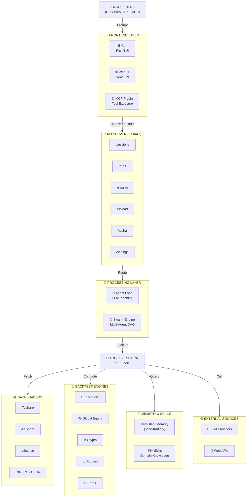
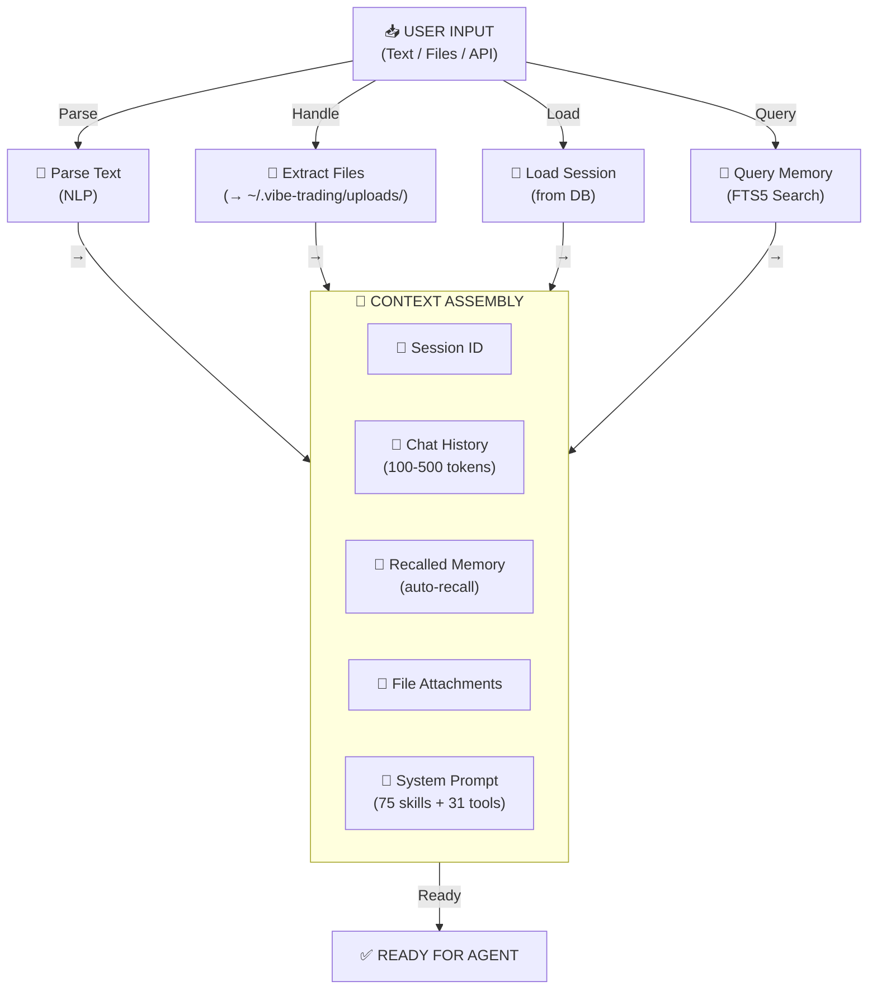
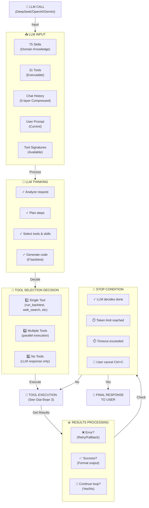
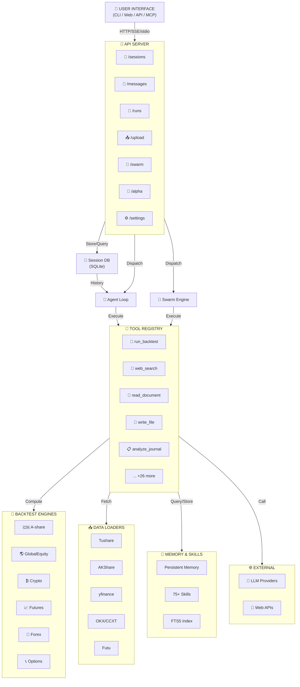
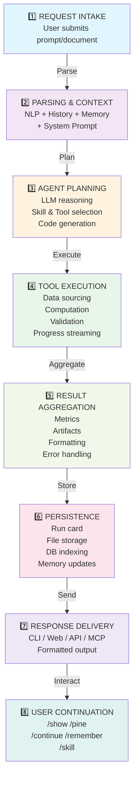

# Vibe-Trading: Mô Tả Chi Tiết Luồng Xử Lý Thông Tin

## 📊 Tổng Quan Kiến Trúc Hệ Thống

**Vibe-Trading** là một hệ thống **AI-powered** dùng để:
- 📈 Nghiên cứu tài chính & phân tích thị trường
- 🔬 Backtesting chiến lược giao dịch
- 🤖 Tự động hóa quyết định đầu tư

**Mô hình hoạt động:** `Request → Agent Processing → Tool Execution → Result Delivery`



---

## 🔄 Luồng Xử Lý Thông Tin Chi Tiết

### **Giai Đoạn 1️⃣: Tiếp Nhận Yêu Cầu (Request Ingestion)**

**📥 Input Sources:**

| Nguồn | Ví Dụ | Format |
|---|---|---|
| 🖥️ **CLI** | `vibe backtest BTC MACD` | Text prompt |
| 🌐 **Web UI** | Chat + file upload | Text + files |
| 📡 **API** | `POST /sessions/{id}/messages` | JSON |
| 🔌 **MCP** | `vibe-trading.backtest()` | Tool call |

**🔄 Processing Steps:**



---

### **Giai Đoạn 2️⃣: Xử Lý Bởi Agent (Agent Loop)**

**🤖 Agent là trái tim của Vibe-Trading.** Nó dùng LLM để lập kế hoạch và thực hiện:



**💡 5-Layer History Compression:**

| Layer | Method | Purpose |
|---|---|---|
| 1️⃣ | Full | Keep complete history |
| 2️⃣ | Sampling | Take every N-th message |
| 3️⃣ | Token bucketing | Group by token count |
| 4️⃣ | Semantic clustering | Merge similar topics |
| 5️⃣ | Summarization | Compress to summary |

Điều này giúp các phiên dài vẫn vừa trong context window.

---

### **Giai Đoạn 3: Thực Hiện Tool (Tool Execution)**

Agent chọn một hoặc nhiều tools. Mỗi tool có **input validation → execution → output formatting**:

#### **Ví Dụ 1: Run Backtest**

```
Tool Call: run_backtest()
    │
    ├─ Params:
    │  ├─ strategy_code (Python)
    │  ├─ symbols (["AAPL", "MSFT"])
    │  ├─ start_date ("2023-01-01")
    │  ├─ end_date ("2024-12-31")
    │  └─ initial_capital (100000)
    │
    ▼
Validate Strategy Code
    │
    ├─ AST parsing: Kiểm tra syntax
    ├─ Security: Cấm dangerous imports
    ├─ Lookahead guard: Cấm future peeking
    └─ Safe defaults: MAX_DRAWDOWN checks
    │
    ▼
Select Backtest Engine (auto-detect market)
    │
    ├─ A-share (CSI300): ChinaAShareEngine
    ├─ US/HK: GlobalEquityEngine
    ├─ Crypto: CryptoEngine
    ├─ China Futures: ChinaFuturesEngine
    ├─ Global Futures: GlobalFuturesEngine
    ├─ Forex: ForexEngine
    ├─ Options: OptionsEngine
    └─ Mixed: CompositeEngine
    │
    ▼
Fetch Market Data
    │
    ├─ Data Registry:
    │  ├─ Tushare (A-share, priority nếu có token)
    │  ├─ AKShare (A-share fallback, free)
    │  ├─ yfinance (HK/US)
    │  ├─ OKX (Crypto)
    │  ├─ CCXT (100+ exchanges)
    │  └─ Futu (HK/US + A-share)
    │
    ├─ Auto-fallback nếu lỗi:
    │  └─ Primary fails → Secondary → Tertiary
    │
    ├─ Caching:
    │  └─ Lưu vào disk (~/.vibe-trading/cache/)
    │
    ▼
Run Backtest Engine
    │
    ├─ Initialize:
    │  ├─ Load OHLCV data
    │  ├─ Apply fundamental filters (nếu có)
    │  └─ Set up portfolio state
    │
    ├─ Simulation Loop:
    │  ├─ For each date t:
    │  │  ├─ Compute indicator (SMA, RSI, etc.)
    │  │  ├─ Evaluate strategy signal (entry/exit)
    │  │  ├─ Execute trade
    │  │  ├─ Update P&L
    │  │  └─ Track metrics
    │  │
    │  └─ (Progress updates: every 3 seconds)
    │
    ├─ Validation:
    │  ├─ Monte Carlo simulation (1000 paths)
    │  ├─ Bootstrap confidence intervals
    │  ├─ Walk-Forward analysis
    │  └─ Benchmark comparison
    │
    ▼
Generate Run Card
    │
    ├─ run_card.json:
    │  ├─ Strategy params
    │  ├─ Metrics (Sharpe, Sortino, Max DD, etc.)
    │  ├─ Trades (entry/exit prices, P&L)
    │  ├─ Artifacts (backtest.csv, strategy.py)
    │  └─ Validation results
    │
    ├─ run_card.md:
    │  └─ Human-readable markdown
    │
    ▼
Return Results
    │
    ├─ Metrics JSON
    ├─ Trade list CSV
    ├─ Strategy code
    ├─ Performance plots (for web UI)
    └─ Warnings/errors
    │
    ▼
Agent Processes Results
    │
    └─ LLM tạo summary & insights
```

#### **Ví Dụ 2: Read Document (PDF/Excel)**

```
Tool Call: read_document()
    │
    ├─ Input: File path (uploaded)
    │
    ▼
Detect File Type
    │
    ├─ PDF → pypdf2 extract
    ├─ Excel → pandas read
    ├─ Word (.docx) → python-docx
    ├─ Images (JPG/PNG) → OCR (pytesseract)
    └─ Text (TXT, CSV, JSON, YAML) → direct read
    │
    ▼
Extract Content
    │
    ├─ PDF: Page-by-page (progress update per page)
    ├─ Excel: Columns + data (progress per sheet)
    ├─ Images: OCR text
    └─ Text: Full content
    │
    ▼
Chunk & Summarize
    │
    ├─ Large docs: Split vào chunks (max 4000 tokens)
    ├─ Send to LLM cho summary
    └─ Reduce context (original content trong files/)
    │
    ▼
Return
    │
    ├─ Content preview (dùng cho agent)
    ├─ Full path (dùng cho access)
    └─ Metadata (pages, tables, etc.)
```

#### **Ví Dụ 3: Analyze Shadow Account**

```
Tool Call: extract_shadow_strategy()
    │
    ├─ Input: Journal data (CSV from upload)
    │
    ▼
Parse Journal
    │
    ├─ Detect columns:
    │  ├─ Date, Entry Price, Exit Price, Qty
    │  ├─ Broker (同花顺/东财/富途/generic)
    │  └─ Infer commissions
    │
    ├─ Extract trades
    │  ├─ Match entry/exit pairs
    │  ├─ Calculate P&L
    │  └─ Calculate metrics (win rate, avg hold, etc.)
    │
    ▼
Profile Behavior
    │
    ├─ Basic Stats:
    │  ├─ Holding days distribution
    │  ├─ Win rate (%)
    │  ├─ Profit factor (gross profit / gross loss)
    │  └─ Max drawdown
    │
    ├─ Bias Detection:
    │  ├─ Disposition effect (keep losers, sell winners)
    │  ├─ Overtrading (excess turnover)
    │  ├─ Momentum chasing (buy high, sell low)
    │  └─ Anchoring (size bias to past prices)
    │
    ▼
Extract Rules
    │
    ├─ Pattern matching:
    │  ├─ Entry patterns (e.g., "buy after 2-day decline")
    │  ├─ Exit patterns (e.g., "sell after 5% gain")
    │  └─ Size patterns (position sizing rules)
    │
    └─ Store as Strategy Template
    │
    ▼
Run Shadow Backtest
    │
    ├─ Use extracted rules
    ├─ Backtest on same period
    ├─ Compare actual vs shadow P&L
    ├─ Highlight rule violations
    └─ Show counterfactual trades
    │
    ▼
Generate Report
    │
    ├─ HTML/PDF with:
    │  ├─ Trade comparison (actual vs shadow)
    │  ├─ Behavior insights
    │  ├─ Improvement opportunities
    │  └─ Exportable strategy code
```

---

### **Giai Đoạn 4: Swarm Execution (Multi-Agent Teams)**

Một luồng xử lý đặc biệt cho nhóm agent:

```
User Input: /swarm run investment_committee '{"topic": "BTC outlook"}'
    │
    ▼
Load Swarm Preset
    │
    ├─ Preset YAML:
    │  ├─ Nodes (agents):
    │  │  ├─ bull_case: "Make the bull case for BTC"
    │  │  ├─ bear_case: "Make the bear case"
    │  │  ├─ risk_review: "Review risks based on both cases"
    │  │  └─ final_call: "PM final recommendation"
    │  │
    │  └─ Edges (data flow):
    │     ├─ bull_case → risk_review
    │     ├─ bear_case → risk_review
    │     └─ risk_review → final_call
    │
    ▼
DAG Execution
    │
    ├─ Topological sort (find parallelizable stages)
    │
    ├─ Stage 1 (parallel):
    │  ├─ bull_case: LLM call #1
    │  └─ bear_case: LLM call #2
    │  │  ├─ Input: Topic + context
    │  │  └─ Output: Bull/bear arguments
    │
    ├─ Stage 2 (sequential):
    │  └─ risk_review: LLM call #3
    │     ├─ Input: Topic + bull output + bear output
    │     └─ Output: Risk analysis
    │
    ├─ Stage 3 (sequential):
    │  └─ final_call: LLM call #4
    │     ├─ Input: Topic + bull + bear + risk
    │     └─ Output: Final recommendation
    │
    ▼
Stream Results (SSE)
    │
    ├─ Each LLM output → chunk stream to client
    ├─ Web UI: Real-time agent debate
    └─ CLI: Live progress bar
    │
    ▼
Persist Swarm Run
    │
    ├─ Store in DB:
    │  ├─ swarm_id
    │  ├─ preset name
    │  ├─ all outputs
    │  ├─ token usage
    │  └─ completion time
```

---

### **Giai Đoạn 5: Trả Lại Kết Quả (Result Delivery)**

```
Tool Results Ready
    │
    ├─ Format outputs:
    │  ├─ Metrics → JSON
    │  ├─ Trades → CSV
    │  ├─ Code → .py file
    │  ├─ Report → HTML/PDF
    │  └─ Plots → image files
    │
    ▼
Persist Run
    │
    ├─ Save to ~/.vibe-trading/runs/{run_id}/
    │  ├─ metrics.json
    │  ├─ strategy.py
    │  ├─ backtest.csv
    │  ├─ benchmark.json
    │  └─ validation_*.json
    │
    ├─ Store in Session DB:
    │  ├─ run_id
    │  ├─ created_at
    │  ├─ user_prompt
    │  ├─ agent_trace
    │  └─ summary
    │
    ▼
Return to User
    │
    ├─ CLI:
    │  ├─ Chính text response
    │  ├─ Run ID
    │  └─ File paths
    │
    ├─ Web UI:
    │  ├─ SSE stream results
    │  ├─ Interactive dashboard
    │  ├─ Charts & metrics
    │  └─ Download buttons
    │
    ├─ API:
    │  ├─ JSON response
    │  ├─ File artifacts
    │  └─ Metadata
    │
    └─ MCP Client:
       └─ Structured tool outputs
    │
    ▼
Optional: Export/Continue
    │
    ├─ Export to TradingView:
    │  └─ /pine <run_id>
    │
    ├─ Continue research:
    │  └─ /continue <run_id> "refine..."
    │
    └─ Create skill from output:
       └─ Save reusable logic
```

---

## 🧠 Memory & Persistence Layer

Vibe-Trading có **2 loại bộ nhớ:**

### **1️⃣ Session Memory (Tạm thời)**

**Cấu trúc:**
```json
{
  "id": "session_abc123",
  "created_at": "2024-12-20T10:00:00Z",
  "messages": [
    {"role": "user", "content": "..."},
    {"role": "assistant", "content": "..."}
  ],
  "tools_called": [
    {"name": "run_backtest", "output": {...}}
  ],
  "compression_state": {...}  // 5-layer compression
}
```

**Lưu tại:** `~/.vibe-trading/sessions/{session_id}.db` (SQLite)

**Chức năng:**

| Chức năng | Mô Tả |
|---|---|
| 💬 Chat History | Lưu tất cả messages trong session |
| 🔍 FTS5 Search | Tìm kiếm nội dung cross-session |
| 📦 Compression | 5-layer compression cho session dài |
| 📊 Tool Tracking | Ghi lại tất cả tool calls & outputs |

### **2️⃣ Persistent Memory (Bền vững)**

**Cấu trúc:**
```markdown
---
name: my-rule-set
type: "rule"  # note | insight | rule
tags: ["preference", "risk-management"]
created_at: 2024-12-20T10:00:00Z
updated_at: 2024-12-20T15:30:00Z
---

Content here...
```

**Lưu tại:** 
- 📄 Files: `~/.vibe-trading/memory/{slug}.md`
- 📇 Index: `~/.vibe-trading/memory/.index.json` (FTS5)

**Dùng để lưu:**

| Loại | Ví Dụ |
|---|---|
| 💡 Preferences | "Tôi thích RSI strategies" |
| 📌 Insights | "Pattern X works trong Y condition" |
| 📏 Rules | "Max 10% drawdown" |
| ✅ Checklists | "Pre-trade checklist" |
| 📚 Knowledge | "Công thức tính Sharpe ratio" |

**Auto-recall bởi Agent:**
```
👤 User: "Create a strategy fitting my profile"
🤖 Agent: [Tự động tìm kiếm memory]
💬 Output: "User prefers RSI + max 10% DD + 5-20 day hold"
```

---

## 📈 Data Sources & Market Coverage

| Loại Thị Trường | Nguồn Chính | Fallback 1 | Fallback 2 |
|---|---|---|---|
| 🇨🇳 A-shares (CSI300) | Tushare | AKShare | — |
| 🇭🇰 HK Equities | yfinance | Futu | AKShare |
| 🇺🇸 US Equities | yfinance | AKShare | — |
| ₿ Crypto | OKX | CCXT (100+) | — |
| 📊 Futures (China) | AKShare | Tushare | — |
| 💱 Forex | AKShare | yfinance | — |
| 📈 Options | IVX | CBOE | — |

**Auto-fallback nếu Primary fails:**
1. ❌ Detect failure
2. 🔄 Try fallback 1
3. 🔄 Try fallback 2
4. ⚠️ Raise error with options

**Caching:** `~/.vibe-trading/cache/{symbol}_{date_range}.parquet`

---

## 🔧 Skill & Tool System

### **75 Skills (Domain Knowledge)**

**Skill Structure:**
```markdown
Skill = Markdown file + Metadata
  📄 Name: "technical-basic"
  📁 Category: "Strategy"
  🔗 Tools used: ["get_market_data", "pattern_recognition"]
  📝 Description: "Basic technical analysis patterns"
  📋 Content:
     ├─ Concept explanation
     ├─ When to use
     ├─ Example code
     └─ Related skills
```

**Storage & Loading:**
- 📍 Location: `~/.vibe-trading/skills/{skill_name}.md`
- 📦 Bundled: `agent/src/skills/*/`
- 🧠 System prompt: All 75 skills loaded

**Agent Commands:**

| Command | Action | Example |
|---|---|---|
| `/load` | Load specific skill | `/load technical-basic` |
| `/skills` | List all skills | `/skills` |
| `save_skill()` | Create new skill | Agent tool call |
| `patch_skill()` | Edit skill | Agent tool call |
| `delete_skill()` | Remove skill | Agent tool call |

### **31 Tools (Execution)**

**Tool Architecture:**
```python
Tool = Python class extends ToolBase
  ├─ name: "run_backtest"
  ├─ description: "Backtests a strategy..."
  ├─ input_schema: {...}  # JSON schema
  ├─ execute(params) → result
  └─ progress_callback() → updates (streaming)
```

**Tool Registry:**

| Aspect | Details |
|---|---|
| 🔍 Discovery | Auto-discover từ `agent/src/tools/` |
| 🚀 Loading | Preload trước khi start agent |
| 🤖 LLM Access | Available via `tool_use` feature |
| 🔌 MCP Exposure | 22/31 tools exposed via MCP server |

---

## 🔐 Security Architecture

| Entry Point | Authentication | Authorization |
|---|---|---|
| 🖥️ CLI (localhost) | ❌ None | ✅ Full access |
| 🌐 Web UI (localhost) | ⚙️ Optional | ✅ Full access |
| 🌐 Web UI (remote) | 🔑 API key | 🔐 Scoped |
| 📡 API (localhost) | ⚙️ Optional | ✅ Full access |
| 📡 API (remote) | 🔑 Auth header | 🔐 Scoped |
| 🔌 MCP (stdio) | ✅ Process-level | ✅ Full access |
| 🔌 MCP (SSE/HTTP) | 🔑 Headers | 🔐 Scoped |

### Tool Exposure & Restrictions

**Local/CLI Environment:**
| Tool Type | Status | Details |
|---|---|---|
| Shell tools | ✅ Enabled | `exec_command` available |
| File I/O | ✅ Enabled | Allowed roots only |
| Web tools | ✅ Enabled | `web_search`, `read_url` |

**Remote API Environment:**
| Tool Type | Status | Details |
|---|---|---|
| Shell tools | ❌ Disabled | Unless `VIBE_TRADING_ENABLE_SHELL_TOOLS=1` |
| File I/O | ⚠️ Restricted | Allowed roots only |
| Web tools | ✅ Enabled | Full web access |

### Code Execution Safety

**Strategy Validation:**
- 🛡️ AST parsing — no arbitrary imports
- 🛡️ Lookahead guard — no future data peeking
- 🛡️ Safe defaults — max drawdown checks

**Path Validation:**
- ✅ Allowed roots: `~/.vibe-trading/uploads/`, `./uploads/`, `./data/`
- ✅ Extra roots: `VIBE_TRADING_ALLOWED_FILE_ROOTS` env var
- ✅ No path traversal (containment check)

---

## 🔄 Complete Request→Response Cycle (Example)

```
User Input:
┌──────────────────────────────────────────────────────────────┐
│ "Backtest a 20/50 MA strategy on AAPL for the past year,    │
│  show Sharpe ratio and max drawdown"                          │
└──────────────────────────────────────────────────────────────┘
                            │
                            ▼
         ┌──────────────────────────────────────────┐
         │ 1. PARSE & CONTEXT (T=0ms)              │
         │ - Understand intent: "backtest"         │
         │ - Extract params: symbol=AAPL           │
         │ - Recall session history (if any)       │
         │ - Load system prompt (75 skills)        │
         └──────────────────────────────────────────┘
                            │
                            ▼
         ┌──────────────────────────────────────────┐
         │ 2. LLM PLANNING (T=500ms)                │
         │ Provider: DeepSeek v4                    │
         │ - Understand: Create MACD strategy       │
         │ - Plan: Call run_backtest tool           │
         │ - Generate: Strategy code (Python)       │
         └──────────────────────────────────────────┘
                            │
                            ▼
         ┌──────────────────────────────────────────┐
         │ 3. TOOL EXECUTION (T=2000-30000ms)       │
         │ Tool: run_backtest                       │
         │ ├─ Strategy validation (OK)              │
         │ ├─ Select engine: GlobalEquityEngine     │
         │ ├─ Fetch data: yfinance (AAPL)           │
         │ ├─ Run simulation (2024 data)            │
         │ ├─ Compute metrics:                      │
         │ │  ├─ Total return: 24.5%                │
         │ │  ├─ Sharpe: 1.82                       │
         │ │  ├─ Max DD: -8.3%                      │
         │ │  └─ Win rate: 56%                      │
         │ └─ Generate artifacts                    │
         └──────────────────────────────────────────┘
                            │
                            ▼
         ┌──────────────────────────────────────────┐
         │ 4. RESPONSE (T=31000ms)                  │
         │ LLM summarizes results:                  │
         │                                          │
         │ "The 20/50 MA crossover on AAPL shows   │
         │  solid performance with 24.5% total      │
         │  return and Sharpe of 1.82. Max          │
         │  drawdown of -8.3% is reasonable.        │
         │  Win rate of 56% indicates edge. Files   │
         │  saved to run_2024_001/"                 │
         └──────────────────────────────────────────┘
                            │
                            ▼
         ┌──────────────────────────────────────────┐
         │ 5. PERSISTENCE (T=31100ms)               │
         │ Save to ~/.vibe-trading/runs/:            │
         │ ├─ metrics.json                          │
         │ ├─ strategy.py                           │
         │ ├─ backtest.csv (trades)                 │
         │ ├─ run_card.json                         │
         │ └─ benchmark.json                        │
         │                                          │
         │ Index in session DB:                     │
         │ ├─ run_id: run_2024_001                  │
         │ ├─ user_prompt: "Backtest 20/50..."      │
         │ └─ summary: "24.5% return, Sharpe 1.82"  │
         └──────────────────────────────────────────┘
                            │
                            ▼
         ┌──────────────────────────────────────────┐
         │ 6. RETURN TO USER (T=31150ms)            │
         │ Display via appropriate channel:          │
         │ ├─ CLI: Text + run_id                    │
         │ ├─ Web: SSE stream + dashboard           │
         │ └─ API: JSON response                    │
         │                                          │
         │ Available next:                          │
         │ ├─ /code run_2024_001 (strategy code)    │
         │ ├─ /pine run_2024_001 (export)           │
         │ ├─ /continue run_2024_001 "..." (refine) │
         │ └─ /show run_2024_001 (full details)     │
         └──────────────────────────────────────────┘
```

> **⏱️ Tổng thời gian:** ~**30 giây** (phần lớn từ backtest engine)

---

## 🏗️ Component Interactions (Dependency Graph)



**Thành phần chính:**

| Thành phần | Chức năng | Ví Dụ |
|---|---|---|
| 🎯 **User Interface** | Entry point cho users | CLI, Web UI, MCP |
| 🔌 **API Server** | Route requests | FastAPI routes |
| 🤖 **Agent Loop** | LLM reasoning & planning | Tool selection |
| 🐝 **Swarm Engine** | Multi-agent orchestration | Debate, consensus |
| 💾 **Session DB** | Chat history & compression | SQLite |
| 🔧 **Tool Registry** | All executable tools | 31 tools |
| 📊 **Backtest Engines** | Strategy evaluation | 7 market types |
| 📥 **Data Loaders** | Market data fetching | 6 primary sources |
| 🧠 **Memory Layer** | Persistent knowledge | User preferences |

---

## 📊 Data Schema Overview

### **Run Card Structure**

```json
{
  "run_id": "run_2024_001",
  "created_at": "2024-12-20T10:30:00Z",
  "strategy": {
    "code": "...python code...",
    "indicators": ["SMA(20)", "SMA(50)"]
  },
  "universe": {
    "symbols": ["AAPL"],
    "start_date": "2023-12-20",
    "end_date": "2024-12-20"
  },
  "metrics": {
    "total_return": 0.245,
    "sharpe_ratio": 1.82,
    "max_drawdown": -0.083,
    "win_rate": 0.56,
    "total_trades": 45
  },
  "trades": [
    {
      "entry_date": "2023-12-25",
      "entry_price": 190.5,
      "exit_date": "2023-12-28",
      "exit_price": 195.2,
      "return": 0.0247
    }
  ],
  "validation": {
    "monte_carlo_paths": 1000,
    "bootstrap_ci": [0.18, 0.32],
    "walk_forward_return": 0.23
  },
  "artifacts": {
    "backtest_csv": "backtest.csv",
    "strategy_py": "strategy.py",
    "plots": ["equity_curve.png", "drawdown.png"]
  }
}
```

### **Persistent Memory Structure**

```markdown
---
name: my-preferred-strategy
description: I prefer RSI-based strategies with max 10% drawdown
created_at: 2024-12-20T10:00:00Z
updated_at: 2024-12-20T15:30:00Z
tags: ["preference", "strategy", "risk-management"]
---

I prefer to use RSI (14) for mean reversion strategies.
Key constraints:
- Maximum drawdown: 10%
- Holding period: 5-20 days
- Position sizing: Fixed 1% risk per trade
```

---

## 🎯 Summary: Information Flow Pipeline



---

## 🔍 Key Design Principles

| # | Nguyên Tắc | Mô Tả |
|---|---|---|
| 1️⃣ | 🧠 **Stateless Agent Loop** | Compress history, no long-term state tracking |
| 2️⃣ | 🛠️ **Tool-Centric** | Agent decides WHAT, tools execute HOW |
| 3️⃣ | 🔄 **Data Fallback** | Multiple sources, automatic retry |
| 4️⃣ | 💾 **Persistent Memory** | Cross-session learning + skill reuse |
| 5️⃣ | 📡 **Streaming Results** | Long operations show progress (3s heartbeat) |
| 6️⃣ | 📋 **Reproducibility** | Every run generates run cards for audit |
| 7️⃣ | 🔐 **Security by Default** | Local fast, remote restricted |
| 8️⃣ | 🧩 **Modular Skills** | 75 domain-specific modules, auto-discoverable |
| 9️⃣ | 🤖 **Multi-LLM Support** | Provider-agnostic (OpenAI, DeepSeek, Ollama, etc.) |
| 🔟 | ☁️ **Cloud-Ready** | Docker, API-first, SSE streaming |

---

## ✨ Hiểu Rõ Luồng Này Sẽ Giúp Bạn:

| Mục Đích | Chi Tiết |
|---|---|
| 🧩 **Mở rộng** | Thêm tools/skills mới hoặc tích hợp data sources |
| 🐛 **Debug** | Trace issues từ input → agent → output |
| ⚡ **Tối ưu hóa** | Cải thiện speed (caching, compression, parallel execution) |
| 🔗 **Tích hợp Custom** | Kết nối dữ liệu từ broker/API riêng |
| 🎯 **Tùy chỉnh Agent** | Modify system prompt, change LLM provider, customize tools |
| 📚 **Scalability** | Thêm backtest engines, data loaders, analysis tools |
